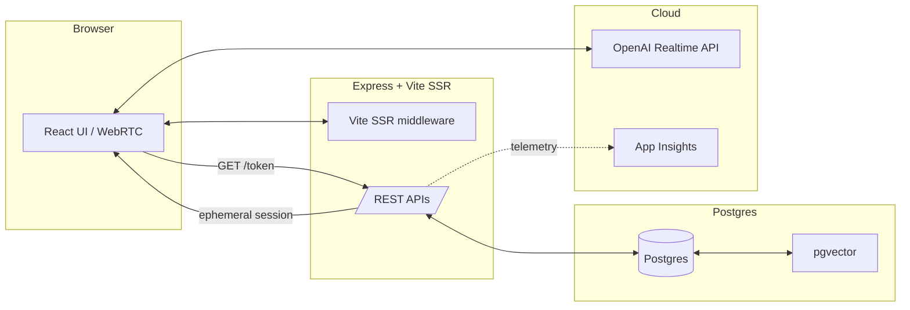

# Architecture Overview

This app combines an Express server, a React client (SSR via Vite middleware), a Postgres + pgvector store for semantic search, and OpenAI Realtime API for low‑latency voice+text interaction over WebRTC.

## High-Level Diagram

## Key Responsibilities
- Server (`server.js`):
  - Issues ephemeral Realtime sessions at `GET /token` with strict tool/answering rules.
  - Provides RAG endpoints: `/search`, `/search/info`, `/enhance-message`, practice `/random-question`, `/check-answer`.
  - Auth via Passport (Google/Facebook/Microsoft) and `express-session` stored in Postgres.
  - SSR: transforms `client/index.html`, renders `entry-server.jsx`, hydrates with `entry-client.jsx`.
- Data (`lib/`): Drizzle ORM connection/schema, `PostgresVectorDatabase`, `ragUtils` for context prep.
- Client (`client/`): React UI, obtains `/token`, negotiates WebRTC, logs events, enforces function-calling flow.
- Observability: `/health` endpoint; optional Application Insights events (e.g., `Citizenship_*`).

## Typical Request Flow
1) Client requests `/token`; server returns ephemeral session config (model, tools, rules).
2) Client negotiates WebRTC directly with OpenAI Realtime API; streams audio/data.
3) For grounding, client or server calls `/enhance-message` and `/search` backed by pgvector.
4) Practice mode uses `/random-question` and `/check-answer` to track and validate answers.
